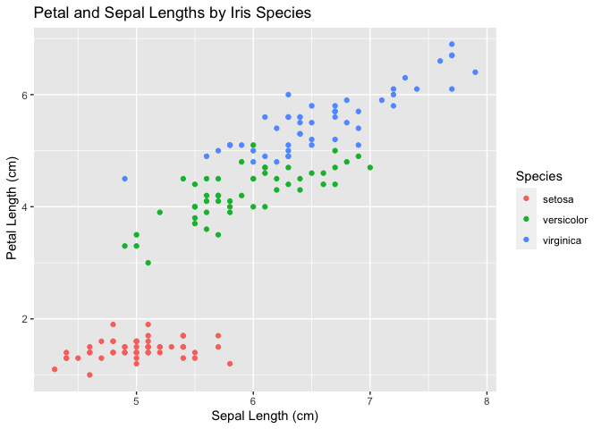

Homework\_7\_goodplot\_badplot
================
Theresa Jones
10/4/2021

``` r
library(tidyverse)
data("iris")
```

``` r
petals.n.sepals <- ggplot(data=iris, mapping=aes(x= Sepal.Length, y= Petal.Length))+
         geom_point()

petals.n.sepals + 
  xlab(NULL) + 
  ylab(NULL)
```

<!-- -->

A problem with this plot is the missing axis titles. This goes against
the principle of graphical integrity that covers clear labeling of the
graph and the data, and is discussed better in section 22.2 of the data
visualization guide by Wilke. The lack of axis labels does not give the
reader/viewer any sense of the context of the relationship displayed on
the plot. There is also no type of legend to define what the datapoints
might be, so while there is a positive correlation shown, there is no
information as to what there is a correlation between. The units of
measurement for the quantities shown on the graph, so again we cannot be
sure that we are using the best range for our data, since we do not have
any context to make an assumption of the data making sense.

``` r
ggplot(data=iris, mapping=aes(x= Sepal.Length, y= Petal.Length, colour= Species))+
         geom_point()+
         ggtitle("Petal and Sepal Lengths by Iris Species")+
  labs(y= " Petal Length (cm)", x = "Sepal Length (cm)")
```

<!-- -->

This would be a better plot simply with the axis titles and a graph
title. We now have an idea of what this positive correlation is between
two (previously) unknown variables. We can see a clear relationship
between petal and sepal length of irises of different species. The
difference in color of the datapoints between species is also a useful
addition to this plot as well because this adds another layer to our
understanding of the data without adding another piece of information to
the data. Without the species-specific color points, one may think to
change the format into something like a bar graph, where the petal and
sepal lengths might be separated by species. A linear relationship
wouldn’t be very easy spot in that format, taking away the opportunity
for an easy to spot trend in the data. Here we provide context with
efficient use of data ink already being used. The efficient use of data
ink on a plot is important for the overall effectiveness and readability
of the data as discussed in Tufte ch. 4.
